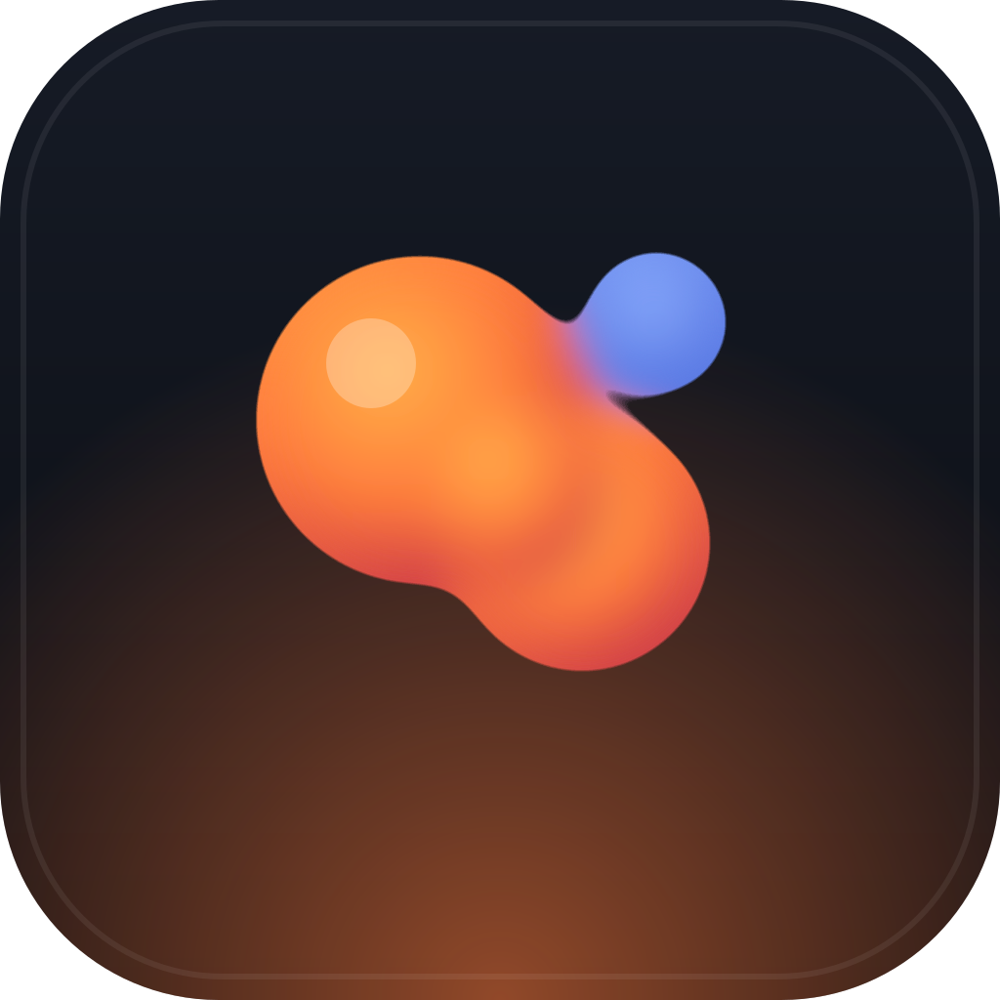

<div align="center">



# Trinket

**A desktop shelf of mouse-driven fidget toys, and a small SDK for building your own.**

Lava lamps, falling sand, ripple pools, magnetic goo. Pick one up, push it around,
put it back. Runs as a native desktop window or in a browser tab from the same code.

</div>

---

## What is on the shelf

| Toy              | What it does                                                                               |
| ---------------- | ------------------------------------------------------------------------------------------ |
| **Lava Lamp**    | Wax blobs heated from below, rendered as GPU metaballs. Drag to stir, right-drag to chill. |
| **Falling Sand** | A cellular-automata sandbox: sand, water, oil, wood, stone, fire and smoke that interact.  |
| **Ripple Pool**  | A wave-equation height field, lit and refracted per pixel. Move the mouse to disturb it.   |
| **Ferrofluid**   | Anisotropic metaballs that spike along the field lines toward your cursor.                 |

Every toy is one file plus, at most, one shader. That is on purpose: the interesting
part of this project is that adding the fifth toy should take an afternoon.

## Design rules

These are the constraints the whole project is built around.

1. **Mouse only.** Everything a toy can do must be reachable with the pointer.
   No keyboard shortcut is ever the only way to do something, and no toy requires
   a chord, a modifier, or a drag longer than a comfortable stroke.
2. **No goal.** Nothing to win, nothing to lose, no progress bar. A fidget stops
   being restful the moment it starts keeping score.
3. **Instant.** A toy is playable the frame it opens. No loading, no tutorial,
   no settings you must configure before it does anything.
4. **Quiet.** Dark by default, no sound, no notifications, nothing that blinks
   for attention. It is meant to sit in the corner of a screen while you think.

## Running it

```bash
python run.py                  # the shelf, in its own app window
python run.py toy lava-lamp    # straight into one toy
python run.py menu             # pick from a list
python run.py doctor           # check prerequisites
```

`run.py` is stdlib-only and installs dependencies on first use. It opens Trinket
in a dedicated Chromium app window with no tab strip or address bar, and stops
the dev server when you close that window, so there is nothing left running
behind you. Without a Chromium browser it falls back to a normal tab.

The npm scripts are all still there if you prefer them:

```bash
npm install
npm run dev            # browser, http://localhost:5173
npm run desktop        # native window (Tauri v2)
npm run build          # static site into dist/
npm run desktop:build  # installers into src-tauri/target/release/bundle/
npm run verify         # types, lint, tests
```

`run.py` has the same set: `dev`, `toy`, `desktop`, `build`, `installer`,
`verify`, `icon`, `doctor`, `menu`.

The desktop build needs a Rust toolchain and, on Windows, the WebView2 runtime
(already present on Windows 11) plus the MSVC build tools. The web build needs
nothing but Node 20 or newer.

## Adding a toy

A toy is a module that exports a `defineToy({...})` call. The shell gives it a
canvas, a fixed-step update loop, a live pointer, and a control panel generated
from whatever controls it declares.

```ts
import { defineToy, damp } from '@sdk';

export default defineToy({
  id: 'pendulum',
  name: 'Pendulum',
  blurb: 'A weight on a string. Drag it and let go.',
  author: 'your name',
  accent: '#9ad5c0',
  surface: '2d',
  controls: [{ id: 'gravity', type: 'range', label: 'Gravity', min: 0, max: 3, default: 1 }],
  setup(ctx) {
    let angle = 0.6;
    let velocity = 0;

    return {
      update(dt) {
        velocity -= Math.sin(angle) * ctx.params.num('gravity') * 6 * dt;
        velocity = damp(velocity, 0, 0.4, dt);
        angle += velocity * dt;
      },
      render() {
        const { c2d, width, height } = ctx;
        c2d.fillStyle = '#0a0b0e';
        c2d.fillRect(0, 0, width, height);
        // ...draw the pendulum at `angle`
      },
    };
  },
});
```

Then add two lines to `src/toys/index.ts` and it appears on the shelf.

The full API, including the control types, the pointer contract, and the WebGL
helpers, is in **[docs/TOY_API.md](docs/TOY_API.md)**. Contribution mechanics
are in **[CONTRIBUTING.md](CONTRIBUTING.md)**.

## How it is put together

```
src/
  sdk/      the contract toys are written against, and nothing else
  shell/    the shelf, the toy host, the generated control panel
  toys/     one directory per toy
src-tauri/  the desktop window
```

The rules that keep this from turning into a tangle:

- Toys import from `@sdk` and nowhere else. They never touch `src/shell`.
- The shell never special-cases a toy. If a toy needs something, it goes in the SDK.
- Simulation runs on a fixed timestep, rendering runs per frame. Fluid and sand
  sims go unstable when `dt` wobbles, so this is not negotiable.
- Anything native is optional and feature-detected, because the same bundle has
  to run in a browser tab.

## Licence

MIT. See [LICENSE](LICENSE).

Part of the [OK Studio](https://github.com/owenpkent) line of small, pointer-friendly tools.
